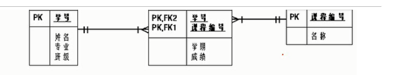
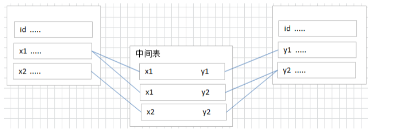

# 关系型数据数据库系统  RDBMS

## 二维表格的关系

#### 数据库管理系统  RDBMS

#### 数据库 database

---

*表,记录，字段*
===============

    1、  E-R(entity-relationship)/(实体--联系）
            实体集
            属性
            联系集
    2、  一个实体集（class）对应于数据库中的一个表（table），
        一个实体（instance）则对应于数据库表中的一行（row），也称为一条记录（record）。
        一个属性（attribute）对应于数据库表中的一列（column），也称为一个字段（field）。
        ORM 思想 （Object Relational Mapping）
            数据库中的一个表 《---》 java或者python 中的一个类
            表中的一条数据 《---》 java或者python 中的一个对象（实体）
            表中的一列数据 《---》 java或者python 中的一个字段/属性（field)

## *表的关系*

    1-1
    1-多
    多-多
    自我引用

### **一对一**

    在实际的开发中应用不多，因为一对一可以创建成一张表。
        举例：设计 学生表 ：学号、姓名、手机号码、班级、系别、身份证号码、家庭住址、籍贯、紧急联系人、...
    拆为两个表：两个表的记录是一一对应关系。
        1、基础信息表 （常用信息）：学号、姓名、手机号码、班级、系别
        2、档案信息表 （不常用信息）：学号、身份证号码、家庭住址、籍贯、紧急联系人、...
    两种建表原则：
        *外键唯一：主表的主键和从表的外键（唯一），形成主外键关系，外键唯一。
        *外键是主键：主表的主键和从表的主键，形成主外键关系。

### **一对多**

    常见实例场景： 客户表和订单表 ， 分类表和商品表 ， 部门表和员工表 。
    举例：
        员工表：编号、姓名、...、所属部门
        部门表：编号、名称、简介
    一对多建表原则：在从表(多方)创建一个字段，字段作为外键指向主表(一方)的主键

### **多对多**

    要表示多对多关系，必须创建第三个表，该表通常称为 联接表 ，
    它将多对多关系划分为两个一对多关系。将这两个表的主键都插入到第三个表中。

### **自我引用**

    要表示多对多关系，必须创建第三个表，该表通常称为 联接表 ，
    它将多对多关系划分为两个一对多关系。将这两个表的主键都插入到第三个表中。

# **第三章，基本的select语言**
## 1、SQL的分类
    DDL： 数据定义语言（操作表的结构）   CREATE:创建----ALTER:修改----DROP:删除----RENAME:改名----TRUNCATE:清空
    DML： 数据操作语言（操作表的数据）   INTER:插入----DELETE:删除----UPDATE:更新----SELECT:查询
    DCL： 数据控制语言（针对权限和事务的控制）  COMMIT:提交----ROLLBACK：回滚----SAVEPOINT:保存节点----GRANT:赋予----REVOKE:撤销

## 2、SQL语言的规则和规范
### 2.1、规则
  * 1、多条语句执行，前面的语句需要加分号，最后一个可加可不加（一条语句执行可加可不加）
  * 2、SQL 可以写在一行或者多行。为了提高可读性，各子句分行写，必要时使用缩进
  * 3、每条命令以 ; 或 \g 或 \G 结束
  * 4、关键字不能被缩写也不能分行
  * 5、关于标点符号
      + a、必须保证所有的()、单引号、双引号是成对结束的
      + b、必须使用英文状态下的半角输入方式
      + c、字符串型和日期时间类型的数据可以使用单引号（' '）表示
      + d、列的别名，尽量使用双引号（" "），而且不建议省略as
### 2.2、SQL大小写规范 （建议遵守）
#### 1、MySQL 在 Windows 环境下是大小写不敏感的
#### 2、MySQL 在 Linux 环境下是大小写敏感的
    数据库名、表名、表的别名、变量名是严格区分大小写的
    关键字、函数名、列名(或字段名)、列的别名(字段的别名) 是忽略大小写的。
#### 3、推荐采用统一的书写规范：
    数据库名、表名、表别名、字段名、字段别名等都小写
    SQL 关键字、函数名、绑定变量等都大写
### 2.3、注释
        单行注释：#注释文字(MySQL特有的方式)
        单行注释：-- 注释文字(--后面必须包含一个空格。)
        多行注释：/* 注释文字 */
### 2.4、命名规则
* 数据库、表名不得超过30个字符，变量名限制为29个
* 必须只能包含 A–Z, a–z, 0–9, _共63个字符
* 数据库名、表名、字段名等对象名中间不要包含空格
* 同一个MySQL软件中，数据库不能同名；同一个库中，表不能重名；同一个表中，字段不能重名
* 必须保证你的字段没有和保留字、数据库系统或常用方法冲突。如果坚持使用，请在SQL语句中使 用`（着重号）引起来
* 保持字段名和类型的一致性，在命名字段并为其指定数据类型的时候一定要保证一致性。假如数据 类型在一个表里是整数，那在另一个表里可就别变成字符型了

# 查询
## 1、导入 
* 方法1： source  文件的全部路劲
* 方法2： 基于具体的图形化界面工具可以导入数据
## 2、基本查询语句
### SELECT 字段1,字段2,... FROM 表名
#### 例如：
* SELECT * FROM employees
* SELECT employee_id,last_name,salary FROM employees
### 注意点
* 伪表 FROM DUAL ===> # dual：伪表
## 3、列的别名
* as：全称：alias(别名)，可以省略
* 列的别名可以使用一对""引起来--------不要使用单引号‘’
#### 例如：
* SELECT employee_id emp_id,last_name AS Lname,salary "工资" FROM employees
* SELECT employee_id emp_id,last_name AS Lname,salary "工资" salary * 12 "annual sal" FROM employees
## 4、去重重复行(去重)
#### 问题：
查询员工表中一共有哪些部门ID

### 错误的(没有去重)
* SELECT department_id FROM employess
### 正确的(去重)
* SELECT DISTINCT department_id FROM employess
* SELECT DISTINCT department_id, salary FROM employees (联合去重没有实际意义)
## 4、空值参与运算
####  空值： NULL
#### NULL 不等于 0 '' 'null'
#### 空值参与运算  结果也一定为空
* SELECT employee_id "员工ID",salary "月工资",salary * (1 + commission_pct) *12 "年工资" FROM employees
* 解决方法： 使用IFNULL(不为空的值,为空的值) -----实际问题解决方案
  * SELECT employee_id "员工ID",salary "月工资",salary * (1 + IFNULL(commission_pct,0)) *12 "年工资" FROM employees
## 5、着重号 ``
#### 出现和保留字、数据库系统或常用方法字段一样  需要使用 `` 包裹
#### 例如： order是关键字
*  SELECT * FROM `order`
## 6、查询常数
*  SELECT "SQL公司", employee_id "员工ID",salary "月工资",salary * (1 + IFNULL(commission_pct,0)) *12 "年工资" FROM employees
## 7、显示表结构
#### 注意可能报错 有两种写法
* DESC employees
* DESCRIBE employees
## 8、过滤数据
* 声明在FROM后面
#### 查询90号部门的员工信息
* SELECT * FROM employees WHERE department_id = 90
#### 查询last_name为king的员工信息
* SELECT * FROM employees WHERE last_name = 'king'
# 运算符
## 1、算数运算符
### + ===> 加 
### - ===> 减 
### * ===> 乘 
### (/ div) ===> 除 
### (% mod) ===> 取余
### 例子
* 在SQL中，+没有连接的作用，就表示加法运算。此时，会将字符串转换为数值（隐式转换）
* SELECT 100 + '1' FROM DUAL;  # 在Java语言中，结果是：1001。 
* SELECT 100 + 'a' FROM DUAL; #此时将'a'看做0处理 
* SELECT 100 + NULL FROM DUAL; # null值参与运算，结果为null
* SELECT 100, 100 * 1, 100 * 1.0, 100 / 1.0, 100 / 2,
  100 + 2 * 5 / 2,100 / 3, 100 DIV 0  # 分母如果为0，则结果为null
  FROM DUAL;
### 取模运算： % mod
* SELECT 12 % 3,12 % 5, 12 MOD -5,-12 % 5,-12 % -5 FROM DUAL;
* 取模运算的符号和被膜数有关  和膜数无关
### 注意点
* 一个整数类型的值对整数进行加法和减法操作，结果还是一个整数；
* 一个整数类型的值对浮点数进行加法和减法操作，结果是一个浮点数；
* 加法和减法的优先级相同，进行先加后减操作与进行先减后加操作的结果是一样的；
* 在Java中，+的左右两边如果有字符串，那么表示字符串的拼接。但是在MySQL中+只表示数 
值相加。如果遇到非数值类型，先尝试转成数值，如果转失败，就按0计算。（补充：MySQL
中字符串拼接要使用字符串函数CONCAT()实现）

## 2、比较运算符

## 3、逻辑运算符

## 4、位运算符

## 5、运算符的优先级

## 6、正则表达式

